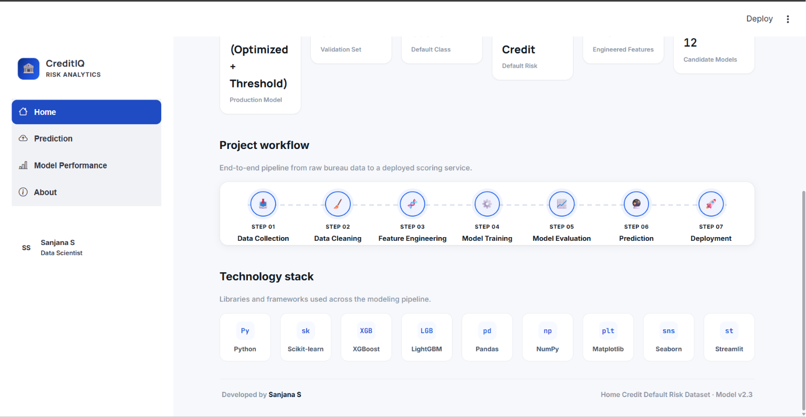
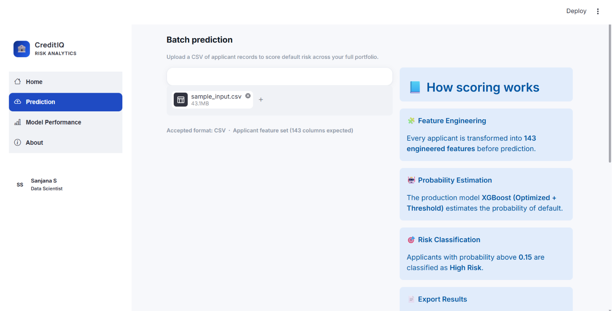
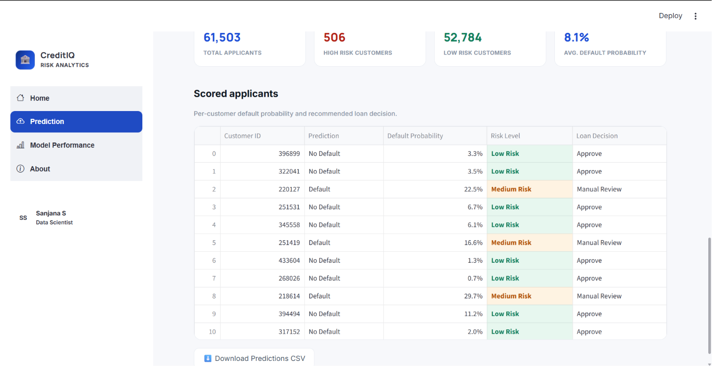
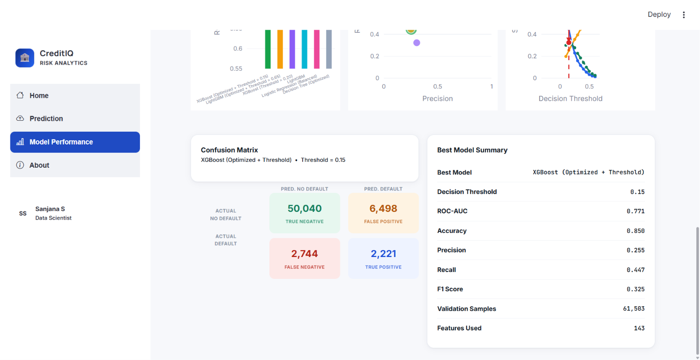
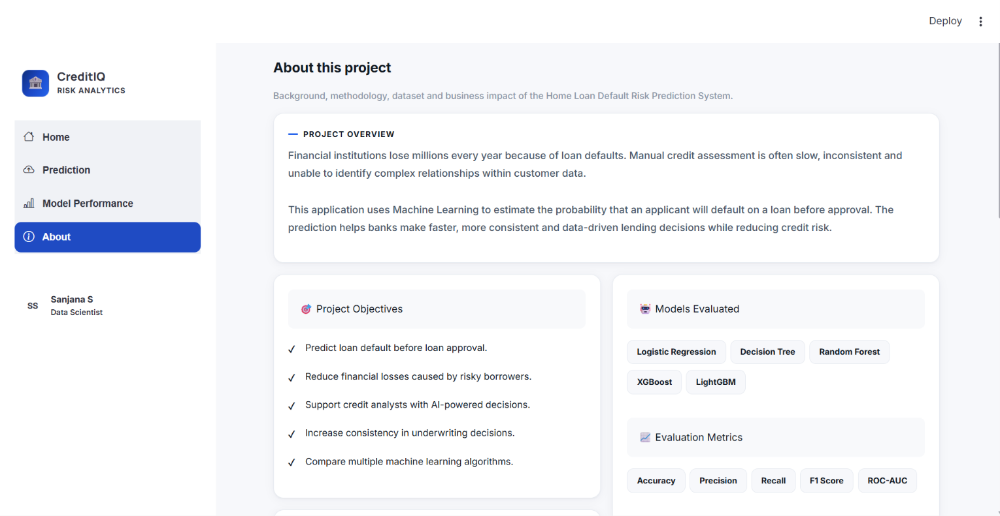
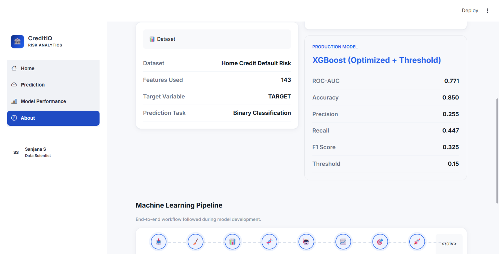
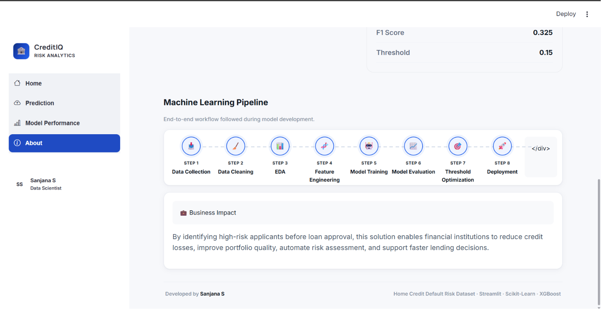

# 🏦 Home Loan Default Risk Prediction System

> An end-to-end Machine Learning application for predicting the probability of home loan default using customer financial, demographic, and credit history information.


---

# 📌 Project Overview

Financial institutions face significant financial losses due to loan defaults. Traditional manual underwriting is often slow, subjective, and unable to capture complex relationships within customer data.

This project leverages Machine Learning to predict whether a customer is likely to default on a home loan before approval. By combining feature engineering, model comparison, threshold optimization, and an interactive Streamlit dashboard, the application supports faster and more consistent lending decisions.

---

# 🎯 Business Objective

The primary objective of this project is to assist financial institutions in identifying high-risk applicants before loan approval by:

- Reducing loan default risk
- Supporting data-driven underwriting
- Improving credit decision consistency
- Increasing operational efficiency
- Minimizing financial losses

---

# 📊 Dataset

**Dataset:** Home Credit Default Risk

**Source:** Kaggle

The dataset contains customer demographic, financial, employment, bureau, and previous credit information.

### Target Variable

| Value | Meaning |
|-------|---------|
| 0 | No Default |
| 1 | Default |

---

# ⚙️ Machine Learning Workflow

```
Data Collection
        │
        ▼
Data Cleaning
        │
        ▼
Exploratory Data Analysis
        │
        ▼
Feature Engineering
        │
        ▼
Model Training
        │
        ▼
Hyperparameter Tuning
        │
        ▼
Threshold Optimization
        │
        ▼
Model Evaluation
        │
        ▼
Batch Prediction
        │
        ▼
Deployment
```

---

# 🧠 Feature Engineering

The dataset underwent extensive preprocessing and feature engineering, including:

- Missing value treatment
- Outlier handling
- Categorical encoding
- Feature scaling
- Derived financial ratios
- Credit history aggregation
- Bureau feature extraction
- Previous application aggregation
- Feature selection

A total of **143 engineered features** were used for model training.

---

# 🤖 Models Evaluated

The following supervised Machine Learning models were trained and compared:

- Logistic Regression
- Decision Tree
- Random Forest
- XGBoost
- LightGBM

The final production model was selected based on ROC-AUC, Precision, Recall, F1 Score, and business requirements.

---

# 🏆 Production Model

**Model:** XGBoost (Optimized)

| Metric | Score |
|---------|------:|
| ROC-AUC | 0.771 |
| Accuracy | 0.850 |
| Precision | 0.255 |
| Recall | 0.447 |
| F1 Score | 0.325 |
| Decision Threshold | 0.15 |

The production model uses **threshold optimization** to increase recall for high-risk applicants while maintaining strong discrimination performance.

---

# 📈 Model Evaluation

The dashboard includes:

- ROC-AUC Comparison
- Precision vs Recall Analysis
- Threshold Optimization
- Confusion Matrix
- Model Comparison Table
- Production Model Summary

---

# 🖥️ Dashboard Features

The Streamlit application provides:

### 🏠 Home

- Project overview
- KPI cards
- Technology stack
- Workflow visualization

---

### 🔮 Prediction

- CSV Upload
- Batch prediction
- Default probability estimation
- Risk categorization
- Download predictions

---

### 📊 Model Performance

- Model comparison
- ROC-AUC visualization
- Precision-Recall analysis
- Threshold optimization
- Confusion matrix
- Production model metrics

---

### ℹ️ About

- Business problem
- Project objectives
- Dataset information
- Machine learning pipeline
- Technologies used
- Business impact

---

# 🛠️ Technology Stack

## Programming

- Python

## Data Processing

- Pandas
- NumPy

## Visualization

- Plotly
- Matplotlib
- Seaborn

## Machine Learning

- Scikit-Learn
- XGBoost
- LightGBM

## Deployment

- Streamlit

## Version Control

- Git
- GitHub

---

# 📂 Project Structure

```
home-loan-default-risk-prediction/
│
├── artifacts/
├── docs/
├── notebooks/
├── reports/
├── src/
│
├── app.py
├── README.md
├── requirements.txt
└── .gitignore
```

---

# 🚀 Installation

Clone the repository

```bash
git clone https://github.com/YOUR_USERNAME/home-loan-default-risk-prediction.git
```

Navigate into the project

```bash
cd home-loan-default-risk-prediction
```

Create a virtual environment

```bash
python -m venv venv
```

Activate it

Windows

```bash
venv\Scripts\activate
```

Linux / macOS

```bash
source venv/bin/activate
```

Install dependencies

```bash
pip install -r requirements.txt
```

Run the application

```bash
streamlit run app.py
```

---

# 📷 Application Screenshots

## 🏠 Home Dashboard

The landing page provides an overview of the deployed production model, key performance indicators, project workflow, and technology stack.

<p align="center">
    
</p>

<p align="center">
    
</p>

---

## 🔮 Prediction Dashboard

Upload a CSV containing applicant records and generate default risk predictions using the deployed XGBoost model.

<p align="center">
    
</p>

<p align="center">
    
</p>

<p align="center">
    
</p>

---

## 📊 Model Performance Dashboard

Compare candidate machine learning models, evaluate ROC-AUC, Precision, Recall, F1-score, threshold optimization, and confusion matrix.

<p align="center">
    
</p>

<p align="center">
    
</p>

<p align="center">
    
</p>

---

## ℹ️ About Dashboard

Provides project overview, objectives, evaluated models, dataset information, production model summary, machine learning pipeline, business impact, and technology stack.

<p align="center">
    
</p>

<p align="center">
    
</p>

<p align="center">
    
</p>

# 💼 Business Impact

The deployed solution enables financial institutions to:

- Detect high-risk applicants early
- Improve underwriting consistency
- Reduce future credit losses
- Support faster loan approval decisions
- Improve portfolio quality
- Automate credit risk assessment

---

# 🔮 Future Enhancements

- SHAP Explainability
- LIME Explanations
- Single Applicant Prediction
- REST API Deployment using FastAPI
- Docker Containerization
- MLflow Experiment Tracking
- Cloud Deployment (AWS/Azure)

---

# 👩‍💻 Author

**Sanjana S**

Aspiring Data Scientist

- LinkedIn: https://www.linkedin.com/in/sanjana0304/
- GitHub: https://github.com/sanjana-goud0304/home-loan-default-risk-prediction

---

# ⭐ If you found this project useful

Please consider giving the repository a ⭐ on GitHub.
